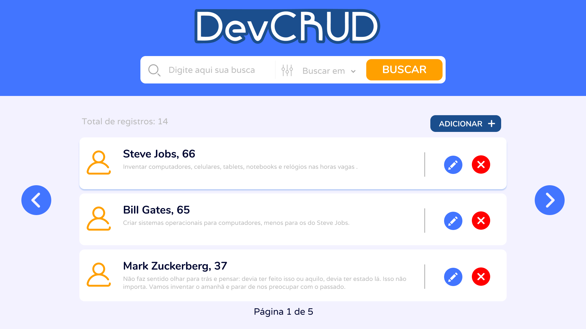

# DevCRUD
API para gerenciar um CRUD de desenvolvedores

> Projeto para demonstrar aptidão com typescript, lógica de programação e Single Page Application, além das habilidades com a construção de UX e UI de forma responsiva e agradável.

## Prototipação

Prototipei as telas, escolhi paletas e frameworks css para poder compor o projeto e, no momento de desenvolver, já ter definidas todas as necessidades e só seguir o modelo criado e refinado. O modelo encontra-se disponível no [Figma](https://www.figma.com/file/6YFqx5xv9ftVflrMam1JcZ/DevCRUD?node-id=0%3A1)

## Tecnologias Principais
<h1 align="center">
    <a href="https://pt-br.reactjs.org/">🔗 React</a>
    <a href="https://nodejs.org/pt-br/">🔗 Node</a>
</h1>

## Status
<h4 align="center"> 
	🚧  DevCRUD 🚀 Concluído, mas...  🚧
</h4>
Devido ao curto período de tempo em que foi desenvolvido do zero, o projeto carece de refinamentos, que pretendo concluir em breve.

Esse projeto está sob licença. Veja o arquivo [LICENÇA](LICENSE.md) para mais detalhes.

[⬆ Voltar ao topo](#DevCRUD) 

